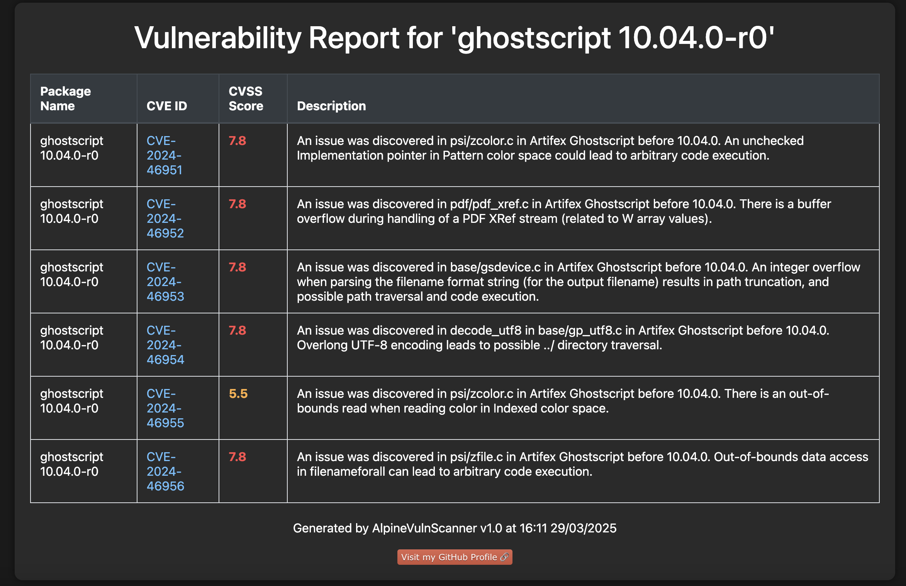

<p align="center">
  
</p>

AlpineVulnScanner is a Python-based tool designed to analyze Linux Alpine `.apk` packages for known vulnerabilities using the NVD (National Vulnerability Database) API.
It generates a well-designed, color-coded HTML report for better visibility and organization of detected vulnerabilities.

---

## 📌 Features
- **Extracts package name and version from Alpine `.apk` files.**
- **Queries the NVD API for known vulnerabilities.**
- **Generates a dark-themed HTML report with:**
  - Color-coded CVSS scores (High, Medium, Low, None).
  - Easy-to-read tables with descriptions and links to CVE pages.

---

## 🚀 Installation
1. **Clone the repository**
```
git clone https://github.com/kimd155/AlpineVulnScanner.git
cd AlpineVulnScanner
```

2. **Install dependencies**
```
pip install -r requirements.txt
```

> Requirements: `jinja2`, `requests`

---

## 🔑 Usage
```
python main.py <path_to_apk> <NVD_API_KEY>
```

Example:
```
python main.py ./ghostscript-10.04.0-r0.apk 273cf361-9b05-49fa-45a45-5d9ab63cec0f
```

The report will be saved as an HTML file in the same directory.
- **Example of the output :**
 

---

## 📊 Report Preview
The generated report will contain:
- **Package name and version**
- **CVE IDs with clickable links to NVD**
- **CVSS Score displayed in colors:**
  - 🔴 High (7.0 - 10.0)
  - 🟠 Medium (4.0 - 6.9)
  - 🔵 Low (0.1 - 3.9)
  - ⚪ None (0.0 or N/A)
- **Description of each vulnerability**

---

## 💡 Future Improvements
- Adding support for batch scanning multiple APK files.
- Implementing a CLI argument parser for more flexibility.

---


## 🤝 Contributing
Pull requests are welcome! Feel free to fork the repository and submit improvements.


